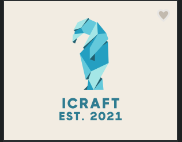
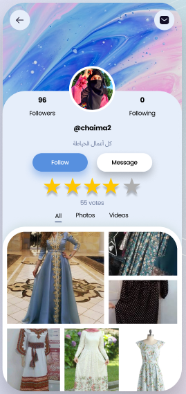
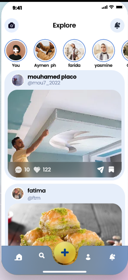
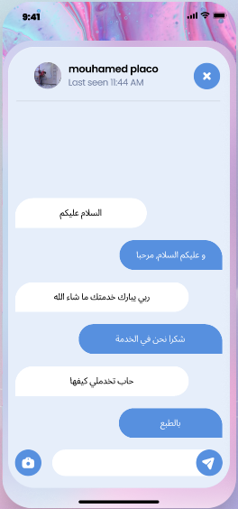
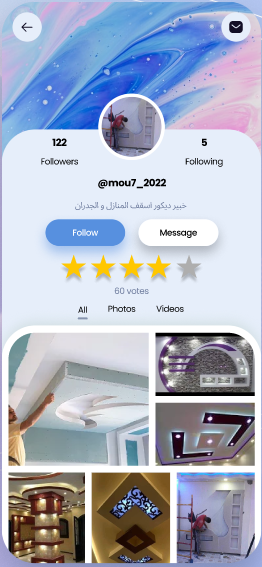

<div align="center">
  
</div>

# Home Services & Crafts Flutter App

This repository contains a **Flutter** project designed to facilitate home services and crafts by connecting users with professionals who can perform the required jobs. Whether it’s home renovations, crafting garments, or any specialized handiwork, this app aims to simplify the process of finding skilled experts.

---

## Features

- **Professional Listings**: Browse through a list of professionals in various fields such as carpentry, tailoring, and more.
- **User Profiles**: Each professional has a detailed profile showcasing their work, ratings, and contact information.
- **Chat Functionality**: Integrated chat system allows users and professionals to discuss job details and pricing.
- **Rating System**: Users can rate professionals based on their experiences, helping others make informed decisions.

---

## Screenshots

Below screenshots demonstrating the app’s interface:

<table align="center">
  <tr>
    <td align="center"><br>Profile Page</td>
    <td align="center"><br>Explore Page</td>
  </tr>
  <tr>
    <td align="center"><br>Chat Interface</td>
    <td align="center"><br>Another Profile Example</td>
  </tr>
</table>

---

## Getting Started

1. **Clone the Repository**:
   ```bash
   git clone https://github.com/mohamed-ladjal-AI/icraft
   cd icraft
   ```

2. **Install Dependencies**:
   ```bash
   flutter pub get
   ```

3. **Run the App**:
   ```bash
   flutter run
   ```
   Make sure you have a device emulator or a physical device connected.

---

## Project Structure

A brief overview of the major folders and files in this project:
```
.
├── android              # Android-specific files
├── assets               # Images, icons, and other assets
├── ios                  # iOS-specific files
├── lib                  # Main Dart code for the application
│   ├── main.dart        # Entry point of the Flutter app
│   └── ...              # Other Dart files, widgets, etc.
├── pubspec.yaml         # Flutter/Dart dependencies
└── README.md            # Project documentation
```

---

## Contributing

Contributions are welcome! Feel free to open issues or submit pull requests. Please review the guidelines in the [CONTRIBUTING.md](CONTRIBUTING.md) file before making any changes.

---

## License

This project is licensed under the [MIT License](LICENSE). You’re free to use, modify, and distribute the code as long as the original license is included.

---

## Contact & Acknowledgments

- **Author**: Mohamed Ladjal  
- **Email**: [mohamed.laadjel2019@gmail.com](mailto:mohamed.laadjel2019@gmail.com)

Special thanks to everyone who provided feedback, testing, or design help throughout the development of this app.
